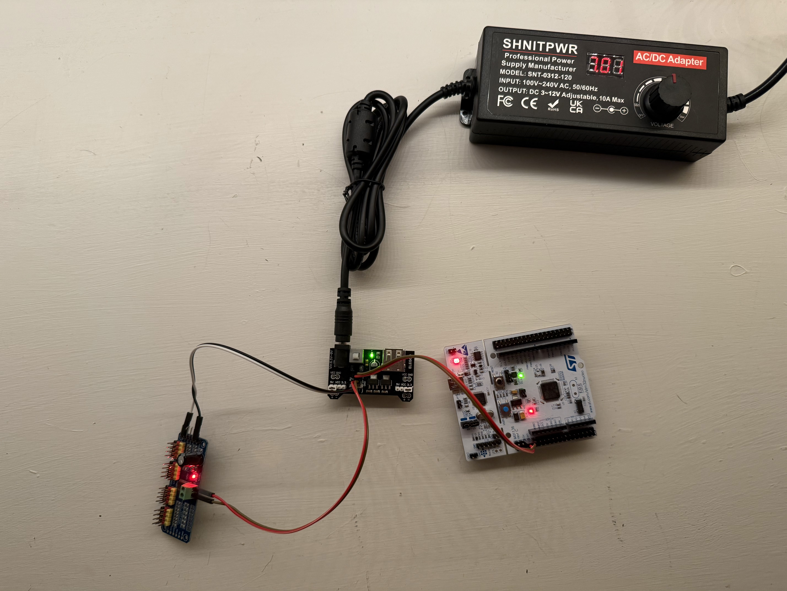

# Robot Arm

## _Devlog_

### _12/10/2025_:
Just finished a working early version of the PCA9685 driver. Using STM's I2C HAL interface to read/write, doing PWM calculations, and getting a servo to oscillate. Got some help online on how to do this, namely from [here](https://www.micropeta.com/video113 "Helpful link") and a number of YouTube videos. Thoroughly annotated the code so its mechanisms are clear and easy to understand. I think at this point I'm ready to start the dreaded design section of this project, but I'm at a crossroads. I saw a really cool [video](https://www.youtube.com/watch?v=5toNqaGsGYs "Helpful link") where a smaller robotic arm "controller" was made with potentiometers, which then controlled the positions of the main robot's servos. I thought this idea was so cool and I really want to give it a shot, so I think my next goal will be to continue to procrastinate the Fusion section of this project and to write a simple ADC interface to control the position of just one servo with one potentiometer. I was also thinking about having multiple "modes" for the arm, where it is controlled by the little controller arm in one mode and maybe controlled with some kind of inverse kinematics algorithm in another mode, but as of today I really have no idea how that could work. I want this project to be a little more software heavy than my last two, so I might spend more time looking into this inverse kinematics idea.

### _12/09/2025_:
Since I finished my Ball and Beam project last month, I've been researching and preparing for this new project, the Robotic Arm. Because it uses multiple servos, I figured a PCA9685 I2C controller would be appropriate for this use-case. I also chose to continue to use the STM32 Nucleo line of microcontrollers. For the electronics and wiring section of this project, I had three goals:
* I wanted to make a project that doesn't rely on battery for voltage. It was kind of inconvenient and wanted to try out using a wall powered DC power supply instead.
* I wanted to power the microcontroller externally, rather than supplying USB power, which is what I had done in my previous projects.
* I wanted to challenge myself to not use breadboards at all; something I had relied on previously.

As of today, I've taken care of the EV5 (5V) for the Nucleo, the V+ (5V) for the PCA9685, and the Vcc (3.3V) for the PCA9685, all using a 3-12V adjustable DC power supply and an Elegoo Breadboard Power Supply module I found lying around. So far, it looks like I'm within spec for all these components. Next, I'll start working on the I2C driver to control just a single servo motor. 
