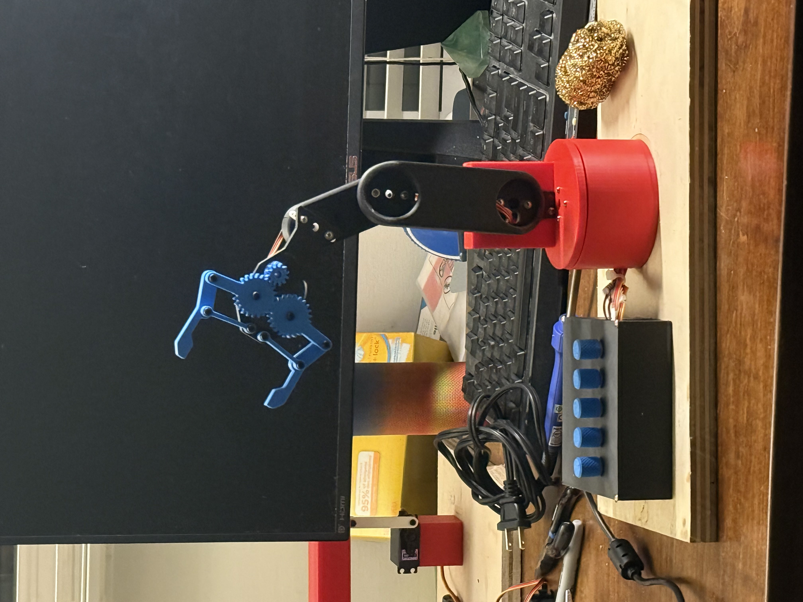
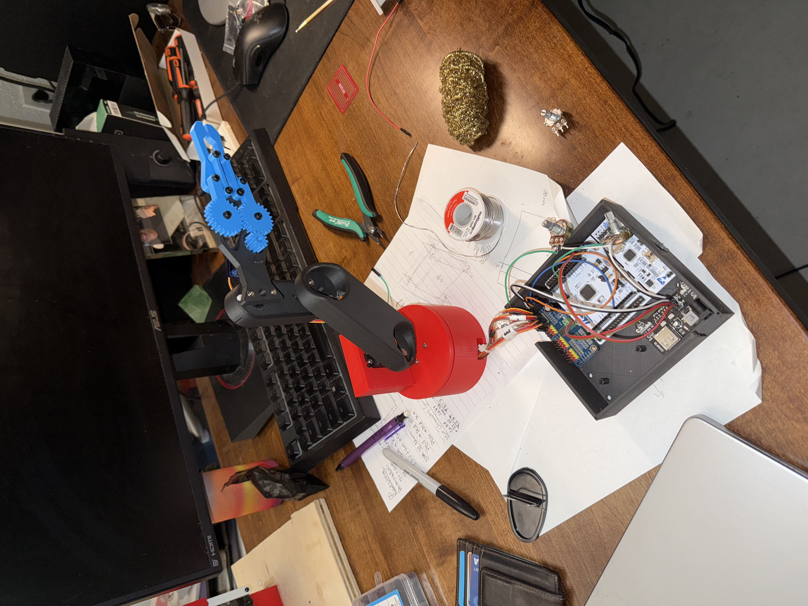
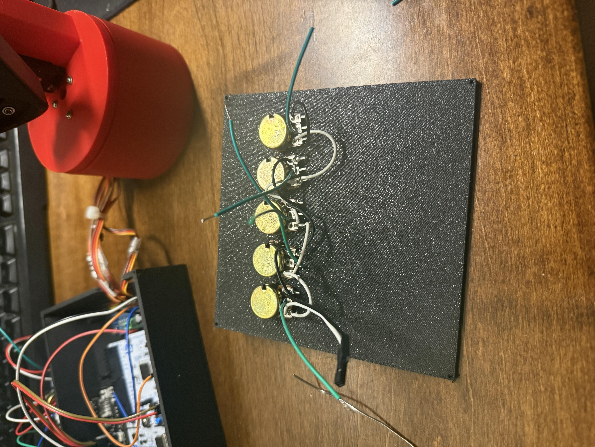
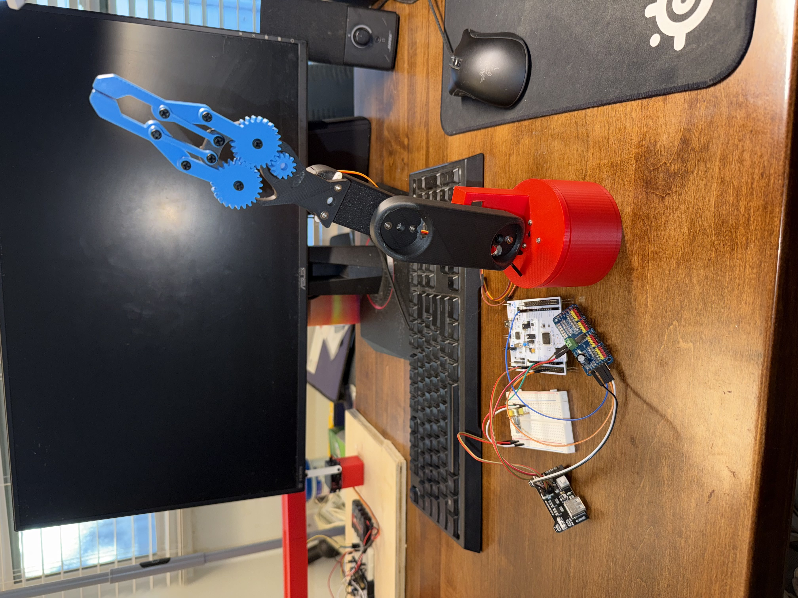
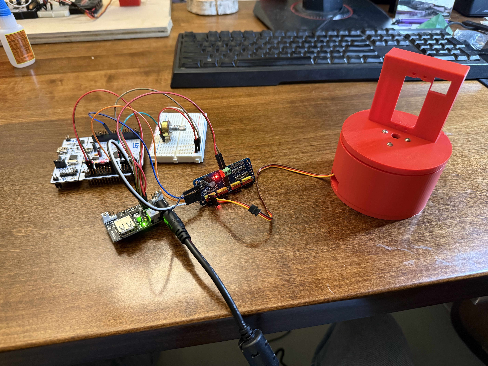
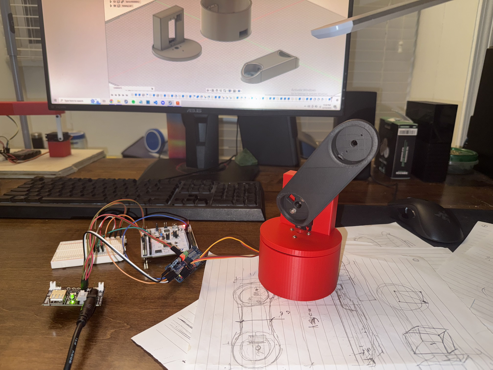
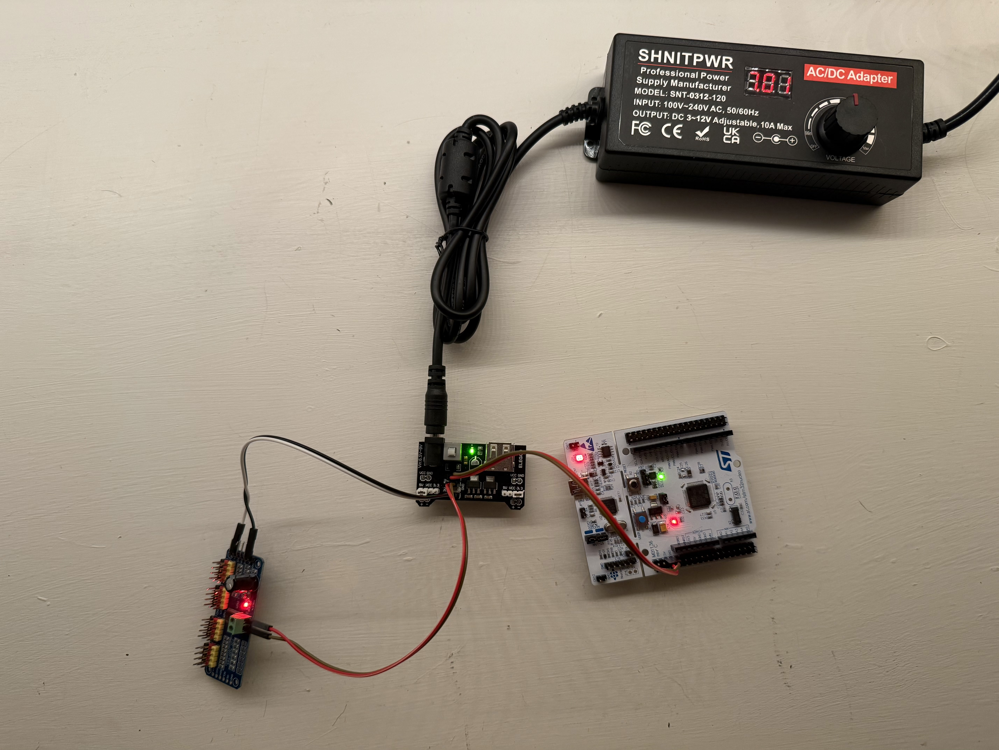

# Robot Arm
Welcome to the readme and devlog for my Robot Arm project! This was about a month long project, done entirely in December 2025. Here you will find the code, pictures, and all the documentation you might need for this personal project. It is a 4-axis robotic arm with a gripper, controlled by an STM32 Nucleo-F401RE microcontroller, a PCA9685 servo driver, and a breadboard power supply module I had laying around. You can find a video of this thing working in the Documentation/Pictures folder. Though I'm leaving this project for now, I do plan on coming back and implementing inverse kinematics control. If you have any questions or need to get in touch, feel free to contact me at jorgelarachesp@gmail.com.

## _Devlog_
### _1/6/2026_:
After I finished the design portion of the robot, I had to come up with a layout and design of the electronics box. I sketched it out on paper, and my original idea was for it to contain:
* the power supply module,
* the STM32 MCU,
* a solder breadboard to supply voltage to the potentiometers, and
* the PCA9685 module.

It wasn't until I modeled it up and printed it that I realized the potentiometers didn't need the breadboard to supply 3.3V and GND to each one, I could just connect the first one to the last 3.3V output on the power supply and daisy chain jumper wires to each subsequent one. I prototyped it out on a solderless breadboard and it worked, so I got to soldering. It was never my strong suit, and I did make a few janky connections that snapped off and had to solder back on later, but it worked! I attached each potentiometer to the lid with some provided nuts and connected their signal wires to the ADC pins on the Nucleo. Unfortunately, this means that you can't remove the lid without disconnecting the signal wires, but I don't mind, since I know exactly where they go. Also there's a big empty space in the box where the solder breadboard would have gone but that's ok. I will admit I made some pretty heinous mistakes with the electronics box design, but its nothing some filing and cutting couldn't fix. 

Another big challenge I faced AFTER designing and making the robot was handling multichannel ADC. This completely blindsided me, as I was operating under the understanding that, if it works and its easy with one potentiometer, it'll be easy with more than one. I was dead wrong. This was a much deeper rabbit hole than I ever expected. I'll spare you the gory details, but I ended up using continuously converted DMA accessed ADC values to an ADC array. You can check out the MX_ADC1_Init function in main.c to see more. Once I had that working, I was done with the project on December 30th!
### _12/20/2025_:
The design portion of the project is almost done. I spent a lot of time on Fusion designing and modeling parts, and I was finally able to assemble a working robotic arm today. I used [this](https://www.youtube.com/watch?v=MkABKJTZjVg "Arm reference video") video as a visual reference for the general structure and assembly for my arm, though I included a fifth servo at the tip of the forearm to control the claw angle. I modeled up a claw in Fusion using [this](https://www.youtube.com/watch?v=ZmckF8zYbp0&t=2116s "Fusion claw tutorial") tutorial and modified part of it to fit my arm. All STLs are now included in this repository. The potentiometer and breadboard in the image below are only there for debugging reasons, they won't be there in the final build.

There are five servos: 
* MG996R base servo (provides rotation)
* MG996R lid servo (connects to the arm)
* 2 MG90 forearm servos (one connects to arm, other to control the angle of the claw)
* MG90 claw servo (controls claw mechanism)

Next, I will disassemble the five main pieces of the arm (base, lid, arm, forearm, claw) and individually center each servo at 90 degrees, so there is equal amount of movement on either side available from the centered position. After that, I'll connect extension jumper cables to each MG90 servo (the base and lid servo's wires can reach the PCA9685 no problem) and label each end to their respective servo's funcion. I'll also make an attempt to hide the servo wires as best I can; I included some cable holes in the design but I'm not sure whether they'll actually be all that helpful. After that, I have three more tasks to tackle:
* Build enclosure for electronics (breadboard power supply circuit, MCU, PCA9685)
* Start programming an inverse kinematics driver
* Start designing a smaller, potentiometer driven controller arm (alternative would be to put five potentiometers in the electronics enclosure to control each servo individually)

Below are some pictures of the design process from this past week:

December 17: Working base and lid

December 18: Arm assembled

  

### _12/10/2025_:
Just finished a working early version of the PCA9685 driver. Using STM's I2C HAL interface to read/write, doing PWM calculations, and getting a servo to oscillate. Got some help online on how to do this, namely from [here](https://www.micropeta.com/video113 "Helpful link") and a number of YouTube videos. Thoroughly annotated the code so its mechanisms are clear and easy to understand. I think at this point I'm ready to start the dreaded design section of this project, but I'm at a crossroads. I saw a really cool [video](https://www.youtube.com/watch?v=5toNqaGsGYs "Helpful link") where a smaller robotic arm "controller" was made with potentiometers, which then controlled the positions of the main robot's servos. I thought this idea was so cool and I really want to give it a shot, so I think my next goal will be to continue to procrastinate the Fusion section of this project and to write a simple ADC interface to control the position of just one servo with one potentiometer. I was also thinking about having multiple "modes" for the arm, where it is controlled by the little controller arm in one mode and maybe controlled with some kind of inverse kinematics algorithm in another mode, but as of today I really have no idea how that could work. I want this project to be a little more software heavy than my last two, so I might spend more time looking into this inverse kinematics idea.

### _12/09/2025_:
Since I finished my Ball and Beam project last month, I've been researching and preparing for this new project, the Robotic Arm. Because it uses multiple servos, I figured a PCA9685 I2C controller would be appropriate for this use-case. I also chose to continue to use the STM32 Nucleo line of microcontrollers. For the electronics and wiring section of this project, I had three goals:
* I wanted to make a project that doesn't rely on battery for voltage. It was kind of inconvenient and wanted to try out using a wall powered DC power supply instead.
* I wanted to power the microcontroller externally, rather than supplying USB power, which is what I had done in my previous projects.
* I wanted to challenge myself to not use breadboards at all; something I had relied on previously.

As of today, I've taken care of the EV5 (5V) for the Nucleo, the V+ (5V) for the PCA9685, and the Vcc (3.3V) for the PCA9685, all using a 3-12V adjustable DC power supply and an Elegoo Breadboard Power Supply module I found lying around. So far, it looks like I'm within spec for all these components. Next, I'll start working on the I2C driver to control just a single servo motor. 
